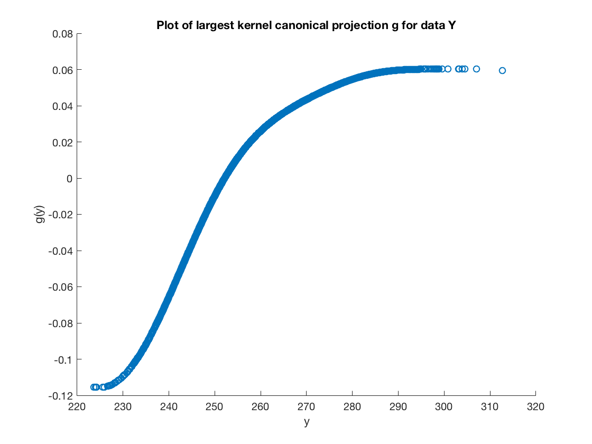
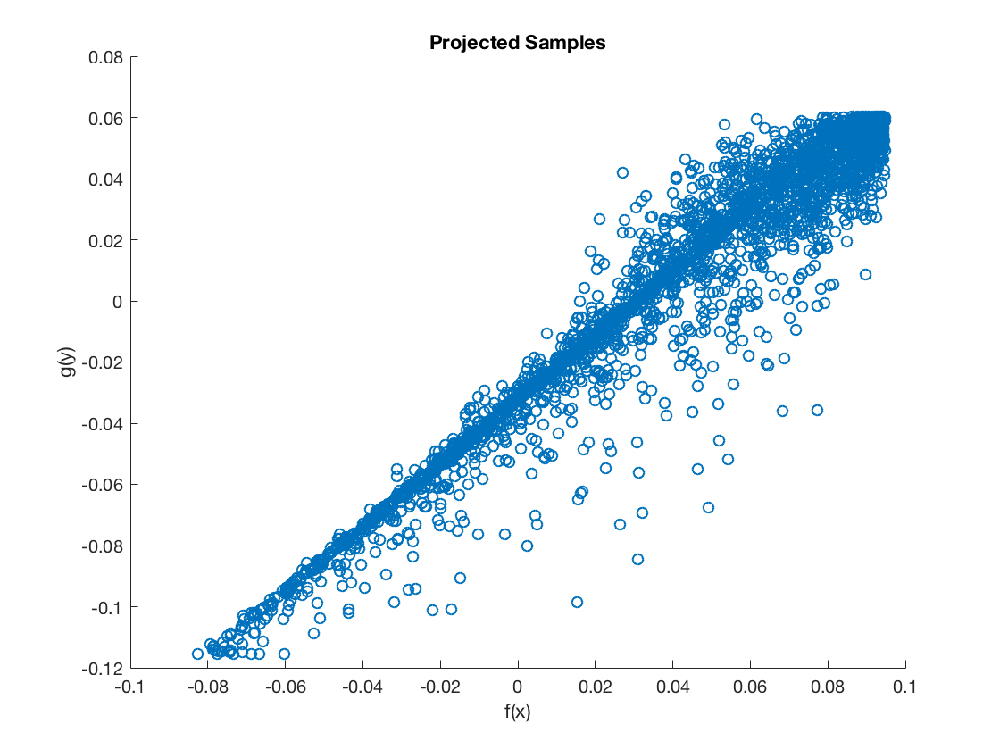

% Advanced Topics - Coursework Q3
% Felix Biggs and Jack Cowling

We ran kernel CCA on the received data with Gaussian Kernels using smoothing constants, $\eta =$ 5 and 20 for X and Y respectively.

The correlation of the CCA sample projections was 0.968 which suggests CCA has successfully found the projection functions that maximise the empirical canonical correlation.

